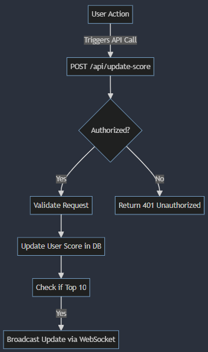
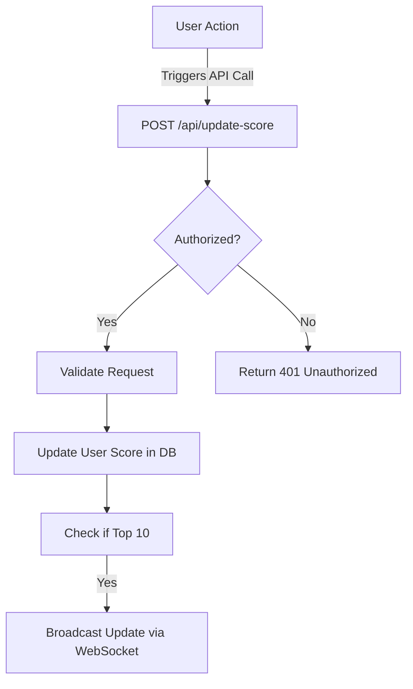

# Scoreboard API Service

## Overview

The Scoreboard API Service is a backend application server designed to manage and display the top 10 user scores on a website. This module ensures real-time updates to the scoreboard and secures the score update mechanism to prevent unauthorized actions.

## Features

1. **Real-Time Score Updates**: Live updates to the scoreboard whenever a user's score is updated.
2. **Top 10 Scores**: The scoreboard displays the top 10 user scores.
3. **Secure Score Update**: Ensures that only authorized actions can update user scores.

## API Endpoints

### 1. Update User Score

-   **Endpoint**: `/api/update-score`
-   **Method**: `POST`
-   **Description**: Updates the user's score upon completion of an action.
-   **Request Headers**:
    -   `Authorization`: Bearer token for user authentication.
-   **Request Body**:
    ```json
    {
        "userId": "string",
        "scoreIncrement": "number"
    }
    ```
-   **Response**:
-   `200 OK`:
    ```json
    {
      "status": "success",
      "newScore": "number"
    }
    ```
-   `401 Unauthorized`:
    ```json
    {
      "status": "error",
      "message": "Unauthorized"
    }
    ```
-   `400 Bad Request`:
    ```json
    {
      "status": "error",
      "message": "Invalid request parameters"
    }
    ```

## WebSocket Endpoint

### 2. Get Top Scores (WebSocket)

-   **Endpoint**: `/ws/top-scores`
-   **Description**: Provides real-time updates of the top 10 user scores.
-   **Client Connection**: Clients connect to the WebSocket endpoint to receive updates.
-   **Message Format**:
-   **Server to Client**:
    ```json
    {
      "type": "topScoresUpdate",
      "topScores": [
        {
          "userId": "string",
          "score": "number"
        },
        ...
      ]
    }
    ```

## Database Schema

### Users Table

| Column | Type   | Description                |
| ------ | ------ | -------------------------- |
| id     | string | Unique identifier for user |
| score  | number | Current score of the user  |

## Flow of Execution



## Security Measures

1. **Authorization Token**: All score update requests must include a valid authorization token.
2. **Input Validation**: Validate all incoming request parameters to prevent SQL injection and other attacks.
3. **Rate Limiting**: Implement rate limiting to prevent abuse of the score update endpoint.

## Improvements

1. **Caching**: Use caching (e.g., Redis) for frequently accessed data like top scores to reduce database load.
2. **Detailed Logging**: Add detailed logging for monitoring and debugging purposes.
3. **Unit Tests**: Implement unit tests for all endpoints to ensure code quality and reliability.
4. **CI/CD Integration**: Integrate with CI/CD pipelines for automated testing and deployment.

## Contributors

-   [Nguyen Cung Ung](https://github.com/stilllove1511)

---

## Flow Diagram



This diagram illustrates the flow of execution from a user action triggering an API call to updating the score in the database and broadcasting the update if necessary.
