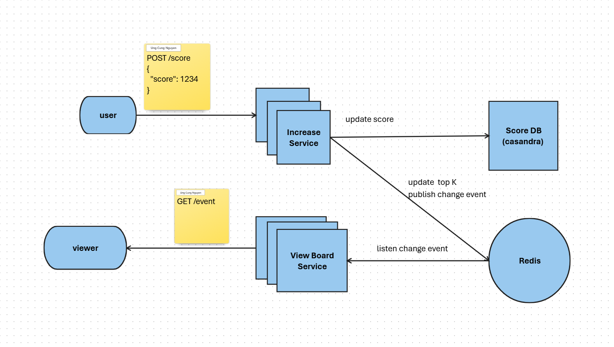
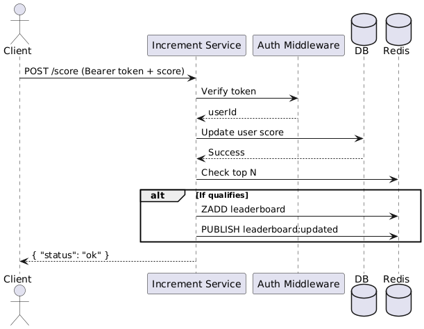
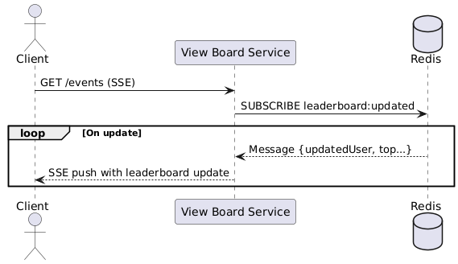

## 📘 DETAILED SPEC: REALTIME LEADERBOARD SYSTEM

---

### ✅ Goal

Build a realtime leaderboard system with two services:

* **Increment Service**: records user scores
* **View Board Service**: provides realtime leaderboard data via SSE

---

## 🔧 1. Architecture Overview
### Architecture Diagram



---

## 📦 2. System Components

### 2.1 Database

* **Persistent Storage**: stores full user score data
* **Atomic Updates**: ensures consistency when updating scores

### 2.2 Redis

* **Sorted Set**: stores top N scores (`ZADD leaderboard <score> <userId>`)
* **Pub/Sub**: publishes `"leaderboard:updated"` messages with top N data
* **Single Threaded**: Redis is single-threaded, so operations are atomic

### 2.3 Increment Service

* Accepts score submissions via HTTP POST
* Authenticates user via JWT or bearer token
* Updates user score in the database
* Compares the updated score with the smallest score in the Redis Sorted Set
* If the updated score qualifies for the top N, updates the Redis Sorted Set and publishes a JSON message to Redis Pub/Sub

### 2.4 View Board Service

* Subscribes to Redis Pub/Sub channel `"leaderboard:updated"`
* Maintains SSE connection to clients
* Pushes updates to connected clients upon receiving Pub/Sub message

### 2.5 Client

* Submits score updates (if player)
* Connects to View Board SSE endpoint to receive realtime leaderboard

---

## 🔐 3. Authentication

* **Increment Service**: requires Bearer token (JWT)
* Middleware extracts `userId` from token
* View Board SSE endpoint may be public or protected depending on use case

---

## 💻 4. API Specification

### 4.1 POST /score

Submit a new user score

* **URL**: `/score`
* **Method**: POST
* **Auth**: Bearer Token
* **Request Body**:

```json
{
  "score": 1234
}
```

* **Response**:

```json
{
  "status": "ok"
}
```

* **Internal Flow**:

  * Authenticate and extract `userId`
  * Update the user's score in the database
  * Compare the updated score with the smallest score in the Redis Sorted Set
  * If the updated score qualifies for the top N:
  * Update the Redis Sorted Set
  ### Internal Flow Diagram

  Refer to the following diagram for the internal flow of the `POST /score` endpoint:

  


---

### 4.2 GET /events

Connect via SSE to receive realtime leaderboard updates

* **URL**: `/events`
* **Method**: GET
* **Headers**:

  * `Accept: text/event-stream`
* **SSE Response Format**:

```
data: { "type": "update", "top": [["user123", "1500"], ["user456", "1400"]] }
```

### Internal Flow Diagram for View Board Service

Refer to the following diagram for the internal flow of the `GET /events` endpoint:



---

## 🧠 5. Redis Pub/Sub Message Format

```json
{
  "type": "update",
  "updatedUser": "user123",
  "newScore": 1500,
  "top": [
  ["user123", "1500"],
  ["user456", "1400"]
  ]
}
```

---

## 🚀 6. Autoscaling

* Both services are stateless and can scale horizontally:

  * **Increment Service**: stateless, scalable
  * **View Board Service**: multiple instances subscribe to Pub/Sub and stream via SSE
* Redis Pub/Sub supports basic fan-out to all subscribers

---

## 🛠️ 7. Future Improvements

* Replace Redis Pub/Sub with **Redis Streams** or **Kafka** for durability and message replay
* Cache top N to reduce Redis reads under high traffic
* Optimize database queries for high write throughput
